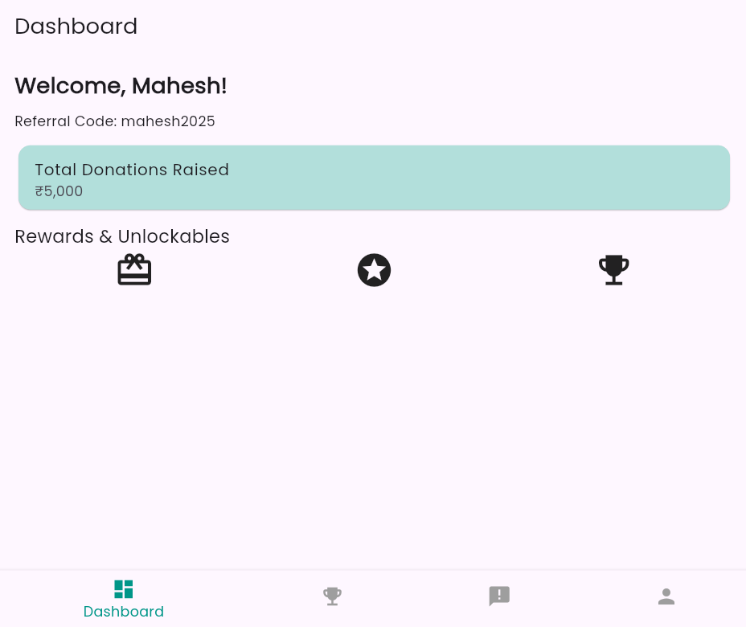
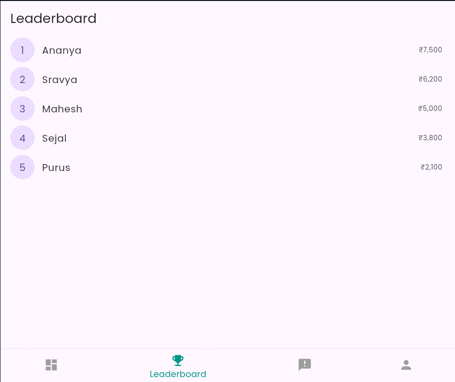
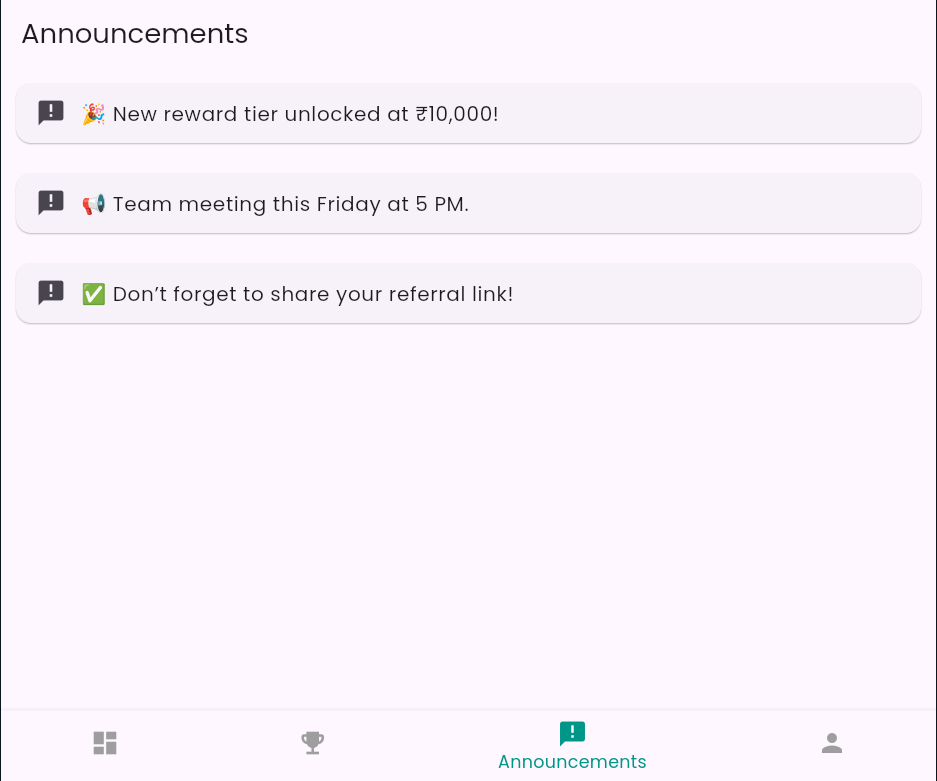
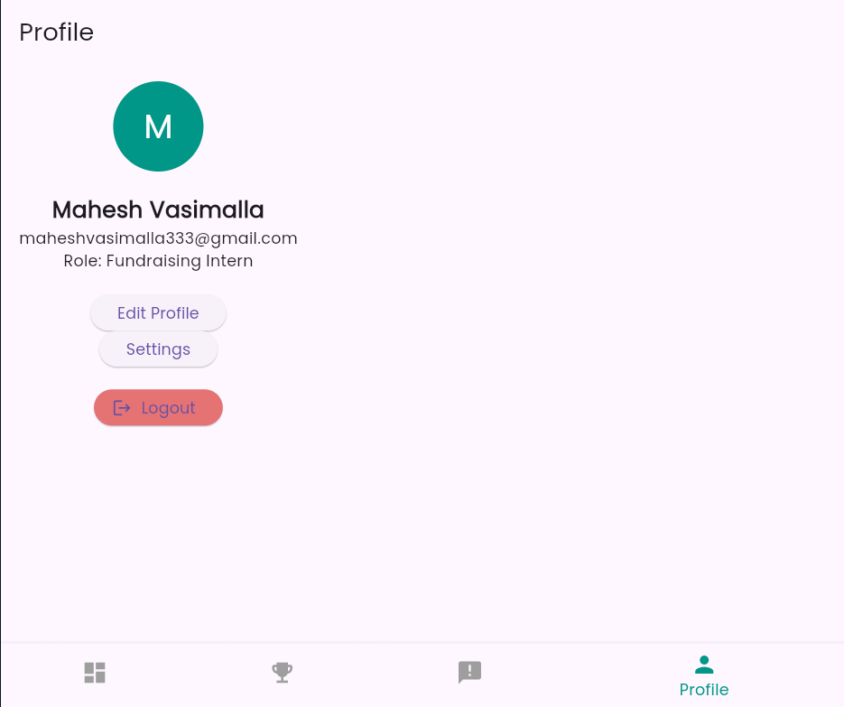

# 📱 Flutter Intern Dashboard App

A UI-only Flutter application built for an internship task. This intern fundraising portal includes essential screens like Login, Dashboard, Leaderboard, Announcements, and Profile — all implemented with mock data and clean UI design.

---

## 🚀 Features

- 🔐 Login/Signup Page (UI only)
- 🏠 Intern Dashboard
- 🏆 Leaderboard Page
- 📢 Announcements Page
- 👤 Profile Page (with logout and settings)
- 🎨 Google Fonts and polished design
- 🔄 Bottom Navigation with page transitions

---

## 📸 App Screenshots

### 🔐 Login Page

### 🏠 Dashboard

### 🏆 Leaderboard

### 📢 Announcements

### 👤 Profile/Settings

---

## 🛠️ Tech Stack

- 💙 Flutter (Dart)
- 🖼️ Google Fonts
- 💡 StatelessWidgets and Navigation
- 📱 DartPad-compatible single file structure

---

## 📂 How to Run

You can run this project on [DartPad](https://dartpad.dev/) as it is entirely within one `main.dart` file. No backend or packages required.

---

## ✍️ Author

- **Mahesh Vasimalla**
- Email: `maheshvasimalla333@gmail.com`

---

## 📌 Note

This app is purely for UI demonstration purposes. All data is mock data; no backend or state management has been implemented.

---

